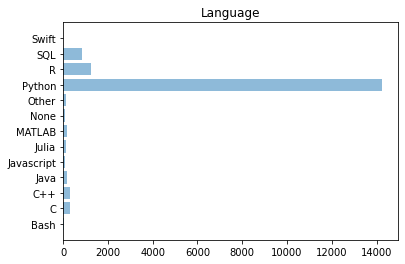

### Libraries Used


```python
import numpy as np
import pandas as pd 
import matplotlib.pyplot as plt
import matplotlib.patches as mpatches
import matplotlib.pyplot as plt
import matplotlib.ticker as ticker
import matplotlib.cm as cma
import matplotlib as mpl
from matplotlib.gridspec import GridSpec
import matplotlib.pyplot as plt
```

### Loading Data


```python
df1 = pd.read_csv('kaggle_survey_2020_responses.csv', delimiter=',')
df1=df1.drop(df1.index[0])
df1 = df1.drop(df1.columns[0], axis=1)
data= df1[['Q1','Q2','Q3','Q4','Q5','Q6','Q8','Q11','Q13','Q15','Q20']]
data = data.rename(columns={'Q1': 'Age','Q2':'Gender','Q3':'Country','Q4':'Education','Q5':'Role','Q6':'Experience','Q8':'Rec_Lang','Q11':'Computing_platform','Q13':'TPU','Q15':'ML_years','Q20':'Comapny_size'})
#data.to_csv(r'C:\Users\utkar\OneDrive - hawk.iit.edu\Desktop\github\66daysofdata\data.csv')
data.head(5)
```


<div>
<style scoped>
    .dataframe tbody tr th:only-of-type {
        vertical-align: middle;
    }

    .dataframe tbody tr th {
        vertical-align: top;
    }

    .dataframe thead th {
        text-align: right;
    }
</style>
<table border="1" class="dataframe">
  <thead>
    <tr style="text-align: right;">
      <th></th>
      <th>Age</th>
      <th>Gender</th>
      <th>Country</th>
      <th>Education</th>
      <th>Role</th>
      <th>Experience</th>
      <th>Rec_Lang</th>
      <th>Computing_platform</th>
      <th>TPU</th>
      <th>ML_years</th>
      <th>Comapny_size</th>
    </tr>
  </thead>
  <tbody>
    <tr>
      <th>1</th>
      <td>30-34</td>
      <td>Man</td>
      <td>United States of America</td>
      <td>Master’s degree</td>
      <td>Data Engineer</td>
      <td>5-10 years</td>
      <td>Python</td>
      <td>A personal computer or laptop</td>
      <td>2-5 times</td>
      <td>1-2 years</td>
      <td>10,000 or more employees</td>
    </tr>
    <tr>
      <th>2</th>
      <td>35-39</td>
      <td>Man</td>
      <td>Argentina</td>
      <td>Bachelor’s degree</td>
      <td>Software Engineer</td>
      <td>10-20 years</td>
      <td>R</td>
      <td>A personal computer or laptop</td>
      <td>Never</td>
      <td>I do not use machine learning methods</td>
      <td>1000-9,999 employees</td>
    </tr>
    <tr>
      <th>3</th>
      <td>30-34</td>
      <td>Man</td>
      <td>United States of America</td>
      <td>Master’s degree</td>
      <td>Data Scientist</td>
      <td>5-10 years</td>
      <td>Python</td>
      <td>A cloud computing platform (AWS, Azure, GCP, h...</td>
      <td>2-5 times</td>
      <td>3-4 years</td>
      <td>250-999 employees</td>
    </tr>
    <tr>
      <th>4</th>
      <td>30-34</td>
      <td>Man</td>
      <td>Japan</td>
      <td>Master’s degree</td>
      <td>Software Engineer</td>
      <td>3-5 years</td>
      <td>Python</td>
      <td>NaN</td>
      <td>NaN</td>
      <td>NaN</td>
      <td>NaN</td>
    </tr>
    <tr>
      <th>5</th>
      <td>30-34</td>
      <td>Man</td>
      <td>India</td>
      <td>Bachelor’s degree</td>
      <td>Data Analyst</td>
      <td>&lt; 1 years</td>
      <td>Python</td>
      <td>A personal computer or laptop</td>
      <td>Never</td>
      <td>NaN</td>
      <td>NaN</td>
    </tr>
  </tbody>
</table>
</div>


### Age
(Q1)


```python
data_age = data['Age'].value_counts().sort_index()

objects = data_age.index
y_pos = np.arange(len(objects))

plt.barh(y_pos,  data_age, align='center', alpha=0.5)
plt.yticks(y_pos, objects)
plt.xlabel('Users')
plt.title('Age-Group')

plt.show()
```


    

    


### Gender
(Q2)


```python
#Gender
data['Gender'] = data['Gender'].replace(['Prefer to self-describe'],'ETC')
data['Gender'] = data['Gender'].replace(['Prefer not to say'],'ETC')
data['Gender'] = data['Gender'].replace(['Nonbinary'],'ETC')
data.Gender.unique()

data_gender = data['Gender'].value_counts().sort_index()

objects = data_gender.index
y_pos = np.arange(len(objects))
#performance = [10,8,6,4,2,1]

plt.barh(y_pos,  data_gender, align='center', alpha=0.5)
plt.yticks(y_pos, objects)
plt.xlabel('Users')
plt.title('Gender')

plt.show()
```


    

    


### Education
(Q3)


```python
d = data['Education'].value_counts().sort_index()

objects = d.index
y_pos = np.arange(len(objects))
#performance = [10,8,6,4,2,1]

plt.barh(y_pos,  d, align='center', alpha=0.5)
plt.yticks(y_pos, objects)
plt.xlabel('Users')
plt.title('Education')

plt.show()
```


    

    


### Current Role
(Q4)


```python
d = data['Role'].value_counts().sort_index()

objects = d.index
y_pos = np.arange(len(objects))
#performance = [10,8,6,4,2,1]

plt.barh(y_pos,  d, align='center', alpha=0.5)
plt.yticks(y_pos, objects)
plt.xlabel('Users')
plt.title('Current Role')

plt.show()
```


    

    


### Programming Experience
(Q6)


```python
d = data['Experience'].value_counts().sort_index()

objects = d.index
y_pos = np.arange(len(objects))
#performance = [10,8,6,4,2,1]

plt.barh(y_pos,  d, align='center', alpha=0.5)
plt.yticks(y_pos, objects)
plt.xlabel('Users')
plt.title('Experience')

plt.show()
```


    

    


### Most Common Langugages Used
(Q7)


```python
Languages = df1[[i for i in df1.columns if 'Q7' in i]] #Q7
Languages_count = pd.Series(dtype='int')
for i in Languages.columns:
    Languages_count[Languages[i].value_counts().index[0]] = Languages[i].count()
    
#Languages_count.to_csv(r'C:\Users\utkar\OneDrive - hawk.iit.edu\Desktop\github\66daysofdata\Languages used.csv')
objects = Languages_count.index
y_pos = np.arange(len(objects))
#performance = [10,8,6,4,2,1]

plt.barh(y_pos,  Languages_count, align='center', alpha=0.5)
plt.yticks(y_pos, objects)
plt.xlabel('')
plt.title('Languages')

plt.show()

```


    

    


### Most Recommended Language
(Q8)


```python
d = data['Rec_Lang'].value_counts().sort_index()

objects = d.index
y_pos = np.arange(len(objects))
#performance = [10,8,6,4,2,1]

plt.barh(y_pos,  d, align='center', alpha=0.5)
plt.yticks(y_pos, objects)
plt.xlabel('')
plt.title('Language')

plt.show()
```


    

    


### IDEs
(Q9)


```python
IDE = df1[[i for i in df1.columns if 'Q9' in i]] #Q9
IDE_count = pd.Series(dtype='int')
for i in IDE.columns:
    IDE_count[IDE[i].value_counts().index[0]] = IDE[i].count()
    
#IDE_count.to_csv(r'C:\Users\utkar\OneDrive - hawk.iit.edu\Desktop\github\66daysofdata\IDE used.csv')
objects = IDE_count.index
y_pos = np.arange(len(objects))
#performance = [10,8,6,4,2,1]

plt.barh(y_pos,  IDE_count, align='center', alpha=0.5)
plt.yticks(y_pos, objects)
plt.xlabel('')
plt.title('IDE')

plt.show()
```


    

    


### Hosted Notebook products used
(Q10)


```python
Notebooks = df1[[i for i in df1.columns if 'Q10' in i]] #Q10
Notebooks_count = pd.Series(dtype='int')
for i in Notebooks.columns:
    Notebooks_count[Notebooks[i].value_counts().index[0]] = Notebooks[i].count()


#Notebooks_count.to_csv(r'C:\Users\utkar\OneDrive - hawk.iit.edu\Desktop\github\66daysofdata\Notebooks used.csv')
objects = IDE_count.index
y_pos = np.arange(len(objects))
#performance = [10,8,6,4,2,1]

plt.barh(y_pos,  IDE_count, align='center', alpha=0.5)
plt.yticks(y_pos, objects)
plt.xlabel('Usage')
plt.title('Programming language usage')

plt.show()
```

### Common computing platforms used
(Q11)


```python
d = data['Computing_platform'].value_counts().sort_index()

objects = d.index
y_pos = np.arange(len(objects))
#performance = [10,8,6,4,2,1]

plt.barh(y_pos,  d, align='center', alpha=0.5)
plt.yticks(y_pos, objects)
plt.xlabel('')
plt.title('Computing Platform')

plt.show()
```


    

    


### Types of specialized hardware
(Q12)


```python
Hardware = df1[[i for i in df1.columns if 'Q12' in i]] #Q12
Hardware_count = pd.Series(dtype='int')
for i in Hardware.columns:
    Hardware_count[Hardware[i].value_counts().index[0]] = Hardware[i].count()

    
    
#Hardware_count.to_csv(r'C:\Users\utkar\OneDrive - hawk.iit.edu\Desktop\github\66daysofdata\Specialized hardware used.csv')    
objects = IDE_count.index
y_pos = np.arange(len(objects))
#performance = [10,8,6,4,2,1]

plt.barh(y_pos,  IDE_count, align='center', alpha=0.5)
plt.yticks(y_pos, objects)
plt.xlabel('Usage')
plt.title('Hardware Types')

plt.show()
```


    

    


### Usage of Tensor Processor Unit
(Q13)


```python
d = data['TPU'].value_counts().sort_index()

objects = d.index
y_pos = np.arange(len(objects))
#performance = [10,8,6,4,2,1]

plt.barh(y_pos,  d, align='center', alpha=0.5)
plt.yticks(y_pos, objects)
plt.xlabel('')
plt.title('TPU')

plt.show()
```


    

    


### visualization libraries
(Q14)


```python
Viz_library = df1[[i for i in df1.columns if 'Q14' in i]] #Q14
Viz_library_count = pd.Series(dtype='int')
for i in Viz_library.columns:
    Viz_library_count[Viz_library[i].value_counts().index[0]] = Viz_library[i].count()
    
#Viz_library_count =data_q14_count 

#Viz_library_count.to_csv(r'C:\Users\utkar\OneDrive - hawk.iit.edu\Desktop\github\66daysofdata\Viz library used.csv')
objects = IDE_count.index
y_pos = np.arange(len(objects))
#performance = [10,8,6,4,2,1]

plt.barh(y_pos,  IDE_count, align='center', alpha=0.5)
plt.yticks(y_pos, objects)
plt.xlabel('Usage')
plt.title('Visualization Libraries')

plt.show()

```


    

    


 ## machine learning methods (Years)
(Q15)


```python
d = data['ML_years'].value_counts().sort_index()

objects = d.index
y_pos = np.arange(len(objects))
#performance = [10,8,6,4,2,1]

plt.barh(y_pos,  d, align='center', alpha=0.5)
plt.yticks(y_pos, objects)
plt.xlabel('')
plt.title('Users')

plt.show()
```


    

    


### Machine learning frameworks
(Q16)


```python
ML_framework = df1[[i for i in df1.columns if 'Q16' in i]] #Q16
ML_framework_count = pd.Series(dtype='int')
for i in ML_framework.columns:
    ML_framework_count[ML_framework[i].value_counts().index[0]] = ML_framework[i].count()

    
#ML_framework_count.to_csv(r'C:\Users\utkar\OneDrive - hawk.iit.edu\Desktop\github\66daysofdata\ML frameworks used.csv')    
objects = IDE_count.index
y_pos = np.arange(len(objects))
#performance = [10,8,6,4,2,1]

plt.barh(y_pos,  IDE_count, align='center', alpha=0.5)
plt.yticks(y_pos, objects)
plt.xlabel('Usage')
plt.title('Machine Learning Framework')

plt.show()
```


    

    


### ML algorithms
(Q17)


```python
ML_algorithms = df1[[i for i in df1.columns if 'Q17' in i]] #Q17
ML_algorithms_count = pd.Series(dtype='int')
for i in ML_algorithms.columns:
    ML_algorithms_count[ML_algorithms[i].value_counts().index[0]] = ML_algorithms[i].count()
    

    
#ML_algorithms_count.to_csv(r'C:\Users\utkar\OneDrive - hawk.iit.edu\Desktop\github\66daysofdata\ML_algorithms used.csv')    
objects = IDE_count.index
y_pos = np.arange(len(objects))
#performance = [10,8,6,4,2,1]

plt.barh(y_pos,  IDE_count, align='center', alpha=0.5)
plt.yticks(y_pos, objects)
plt.xlabel('Usage')
plt.title('ML Algorithms')

plt.show()
```


    

    


###  computer vision methods
(Q18)


```python
Computer_vision = df1[[i for i in df1.columns if 'Q18' in i]] #Q18
Computer_vision_count = pd.Series(dtype='int')
for i in Computer_vision.columns:
    Computer_vision_count[Computer_vision[i].value_counts().index[0]] = Computer_vision[i].count()

#Computer_vision_count.to_csv(r'C:\Users\utkar\OneDrive - hawk.iit.edu\Desktop\github\66daysofdata\Computervision used.csv')    
objects = IDE_count.index
y_pos = np.arange(len(objects))
#performance = [10,8,6,4,2,1]

plt.barh(y_pos,  IDE_count, align='center', alpha=0.5)
plt.yticks(y_pos, objects)
plt.xlabel('Usage')
plt.title('computer vision methods')

plt.show()
Computer_vision_count
```


    

    


    General purpose image/video tools (PIL, cv2, skimage, etc)                                                              2139
    Image segmentation methods (U-Net, Mask R-CNN, etc)                                                                     2003
    Object detection methods (YOLOv3, RetinaNet, etc)                                                                       2079
    Image classification and other general purpose networks (VGG, Inception, ResNet, ResNeXt, NASNet, EfficientNet, etc)    3511
    Generative Networks (GAN, VAE, etc)                                                                                     1092
    None                                                                                                                    1153
    Other                                                                                                                     71
    dtype: int64


###  natural language processing (NLP) methods
(Q19)


```python
NLP = df1[[i for i in df1.columns if 'Q19' in i]] #Q19
NLP_count = pd.Series(dtype='int')
for i in NLP.columns:
    NLP_count[NLP[i].value_counts().index[0]] = NLP[i].count()

NLP_count.to_csv(r'C:\Users\utkar\OneDrive - hawk.iit.edu\Desktop\github\66daysofdata\NLP.csv')    
objects = IDE_count.index
y_pos = np.arange(len(objects))
#performance = [10,8,6,4,2,1]

plt.barh(y_pos,  IDE_count, align='center', alpha=0.5)
plt.yticks(y_pos, objects)
plt.xlabel('Usage')
plt.title('NLP methods')

plt.show()
```


    

    


###  Size of the current company
(Q20) 


```python
d = data['Comapny_size'].value_counts().sort_index()

objects = d.index
y_pos = np.arange(len(objects))
#performance = [10,8,6,4,2,1]

plt.barh(y_pos,  d, align='center', alpha=0.5)
plt.yticks(y_pos, objects)
plt.xlabel('')
plt.title('')

plt.show()
```


    

    


###  Activities that make up an important part of your role at work
(Q23)


```python
task = df1[[i for i in df1.columns if 'Q23' in i]] #Q23
task_count = pd.Series(dtype='int')
for i in task.columns:
    task_count[task[i].value_counts().index[0]] = task[i].count()

#task_count.to_csv(r'C:\Users\utkar\OneDrive - hawk.iit.edu\Desktop\github\66daysofdata\Activities used.csv')    
objects = task_count.index
y_pos = np.arange(len(objects))
performance = [10,8,6,4,2,1]

plt.barh(y_pos,  task_count, align='center', alpha=0.5)
plt.yticks(y_pos, objects)
plt.xlabel('')
plt.title('Task')

plt.show()
```


    

    


###  Cloud computing platforms do you use on a regular basis
(Q26-A)


```python
cloud_computing_platform = df1[[i for i in df1.columns if 'Q26_A' in i]] #Q26A
cloud_computing_platform_count = pd.Series(dtype='int')
for i in cloud_computing_platform.columns:
    cloud_computing_platform_count[cloud_computing_platform[i].value_counts().index[0]] = cloud_computing_platform[i].count()

#cloud_computing_platform_count.to_csv(r'C:\Users\utkar\OneDrive - hawk.iit.edu\Desktop\github\66daysofdata\Cloud computing used.csv')     
objects = cloud_computing_platform_count.index
y_pos = np.arange(len(objects))
#performance = [10,8,6,4,2,1]

plt.barh(y_pos,  cloud_computing_platform_count, align='center', alpha=0.5)
plt.yticks(y_pos, objects)
plt.xlabel('Usage')
plt.title('Cloud Coputing Platform')

plt.show()
```


    

    


###  Big data products
(Q29-A)


```python
BigData = df1[[i for i in df1.columns if 'Q29_A' in i]] #Q26A
BigData_count = pd.Series(dtype='int')
for i in BigData.columns:
    BigData_count[BigData[i].value_counts().index[0]] = BigData[i].count()

#BI_tools_count.to_csv(r'C:\Users\utkar\OneDrive - hawk.iit.edu\Desktop\github\66daysofdata\BI_tools used.csv')         
objects = BigData_count.index
y_pos = np.arange(len(objects))
#performance = [10,8,6,4,2,1]

plt.barh(y_pos,  BigData_count, align='center', alpha=0.5)
plt.yticks(y_pos, objects)
plt.xlabel('Usage')
plt.title('Big Data Products')

plt.show()
```


    

    


### Business intelligence tools
(Q31-A)


```python
BI_tools = df1[[i for i in df1.columns if 'Q31_A' in i]] #Q26A
BI_tools_count = pd.Series(dtype='int')
for i in BI_tools.columns:
    BI_tools_count[BI_tools[i].value_counts().index[0]] = BI_tools[i].count()

BI_tools_count.to_csv(r'C:\Users\utkar\OneDrive - hawk.iit.edu\Desktop\github\66daysofdata\BI_tools used.csv')         
objects = BI_tools_count.index
y_pos = np.arange(len(objects))
#performance = [10,8,6,4,2,1]

plt.barh(y_pos,  BI_tools_count, align='center', alpha=0.5)
plt.yticks(y_pos, objects)
plt.xlabel('Usage')
plt.title('BI Tools')

plt.show()
```


    

    

